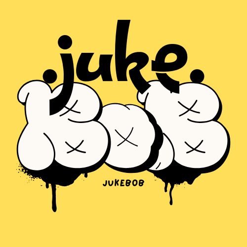

<p align="center">
  
</p>

<h1 align="center">🎵 JukeBoB AI</h1>

<p align="center">
  <strong>The Ultimate Party Entertainment Platform</strong>
</p>

<p align="center">
  
  
  
  
</p>

<p align="center">
  <a href="#-features">Features</a> •
  <a href="#-quick-start">Quick Start</a> •
  <a href="#-architecture">Architecture</a> •
  <a href="#-api-reference">API</a> •
  <a href="#-mobile-app">Mobile App</a>
</p>

---

## ✨ Features

| Feature | Description |
|---------|-------------|
| 🎵 **Smart Jukebox** | Crowd-controlled music with VIP/Regular queue system and real-time tipping |
| 🎮 **Games Hub** | Multiplayer games (Tic Tac Toe) with WebSocket real-time sync |
| 🎧 **AI DJ Studio** | Dual turntable mixing interface with auto-crossfade |
| 💰 **Payment System** | Tip-based monetization with 5% platform fee |
| 📱 **Cross-Platform** | Web + Flutter mobile apps for iOS, Android, and Desktop |

---

## 🚀 Quick Start

### Prerequisites

- **Python 3.11+** (3.12 recommended)
- **Node.js** (optional, for advanced frontend development)
- **Flutter SDK** (optional, for mobile app development)

### Installation

```bash
# 1. Clone the repository
git clone https://github.com/yourusername/JukeBoB_AI.git
cd JukeBoB_AI

# 2. Create virtual environment
python -m venv .venv

# 3. Activate virtual environment
# Windows PowerShell:
.\.venv\Scripts\Activate.ps1
# macOS/Linux:
source .venv/bin/activate

# 4. Install dependencies
pip install fastapi uvicorn python-dotenv qrcode pillow pydantic python-multipart stripe supabase websockets beautifulsoup4
```

### Running the Application

```bash
# Start the backend server
cd backend
python -m uvicorn main:app --reload --host 0.0.0.0 --port 5000

# In a new terminal, serve the frontend (optional)
cd frontend
python -m http.server 8080
```

### Access Points

| Service | URL |
|---------|-----|
| 🖥️ **Frontend** | http://localhost:8080 |
| 🔌 **Backend API** | http://localhost:5000 |
| 📚 **API Docs (Swagger)** | http://localhost:5000/docs |
| 📖 **API Docs (ReDoc)** | http://localhost:5000/redoc |

---

## 🏗️ Architecture

```
JukeBoB_AI/
├── 📂 backend/                 # FastAPI Python Backend
│   ├── main.py                 # Main API server (50+ endpoints)
│   ├── ai_dj.py                # AI DJ agent logic
│   ├── admin.py                # Admin panel functionality
│   ├── tracker.py              # Analytics tracking
│   └── wtpt.py                 # Additional utilities
│
├── 📂 frontend/                # Web Frontend
│   ├── index.html              # Main application UI
│   ├── landing.html            # Landing page
│   ├── admin.html              # Admin dashboard
│   ├── app.js                  # Core JavaScript logic
│   ├── styles.css              # Theme-based styling
│   └── *.html                  # Additional pages (about, privacy, etc.)
│
├── 📂 flutter_app/             # Cross-Platform Mobile App
│   ├── lib/
│   │   ├── main.dart           # App entry point
│   │   ├── config.dart         # API configuration
│   │   ├── styles.dart         # Theme definitions
│   │   └── screens/            # UI screens
│   ├── android/                # Android platform files
│   ├── ios/                    # iOS platform files
│   └── web/                    # Web platform files
│
├── 📂 attached_assets/         # Static assets and media
├── 📄 pyproject.toml           # Python project configuration
├── 📄 uv.lock                  # UV package lock file
└── 📄 README.md                # This file
```

---

## 🎵 Core Modules

### 1. Jukebox System

The heart of JukeBoB - a crowd-controlled music queue with monetization.

**Flow:**
```
Guest Request → Tip Amount Check → Queue Assignment → DJ Plays → Tip Released
                     │
                     ├── ₹10+ → VIP Queue (Priority)
                     └── < ₹10 → Regular Queue
```

**Key Features:**
- 🎫 Session-based parties with QR code joining
- 💵 VIP priority queue for higher tippers
- 🔐 Password-protected sessions
- 📊 Real-time stats and analytics
- 💸 5% platform fee on payouts

### 2. Games Hub

Real-time multiplayer games with WebSocket synchronization.

| Game | Players | Features |
|------|---------|----------|
| ⭕ Tic Tac Toe | 2 | Scoreboard, Leaderboard, Emoji reactions, Rematch |
| 🎭 Mafia | 5+ | *Coming Soon* |

### 3. AI DJ Studio

Professional-style dual turntable mixing interface.

- 🎚️ Dual deck audio playback
- 🔄 Crossfader for smooth transitions
- 🤖 Auto-mix with AI-powered crossfading
- 🎛️ Individual deck controls

---

## 🔌 API Reference

### Session Management

| Method | Endpoint | Description |
|--------|----------|-------------|
| `POST` | `/api/sessions/create` | Create new jukebox session |
| `GET` | `/api/sessions/{id}` | Get session details |
| `POST` | `/api/sessions/{id}/join` | Join session with password |
| `POST` | `/api/sessions/{id}/resume` | Resume existing session |

### Song Requests

| Method | Endpoint | Description |
|--------|----------|-------------|
| `POST` | `/api/requests/submit` | Submit song request with tip |
| `GET` | `/api/requests/{session_id}` | Get queue (VIP + Regular) |
| `POST` | `/api/requests/{id}/complete` | Mark song as played |
| `POST` | `/api/requests/{id}/skip` | Skip song (refund tip) |
| `POST` | `/api/requests/vote` | Vote for a song |
| `POST` | `/api/requests/tip` | Add tip to existing request |

### Games

| Method | Endpoint | Description |
|--------|----------|-------------|
| `POST` | `/api/games/create` | Create game room |
| `POST` | `/api/games/join/{code}` | Join game with password |
| `GET` | `/api/games/{code}` | Get game state |
| `POST` | `/api/games/move` | Make a game move |
| `POST` | `/api/games/emoji` | Send emoji reaction |
| `POST` | `/api/games/restart` | Request game restart |

### AI DJ

| Method | Endpoint | Description |
|--------|----------|-------------|
| `POST` | `/api/dj/{session_id}/enable` | Enable AI DJ mode |
| `GET` | `/api/dj/{session_id}/playlist` | Get DJ playlist |
| `POST` | `/api/dj/{session_id}/next` | Play next track |

### Payments

| Method | Endpoint | Description |
|--------|----------|-------------|
| `POST` | `/api/checkout/process` | Process tip payout (UPI/GPay) |
| `GET` | `/api/transactions/{id}` | Get transaction details |
| `GET` | `/api/app/revenue` | Get platform revenue stats |

### WebSocket

| Endpoint | Description |
|----------|-------------|
| `WS /ws/{session_id}` | Real-time session updates |

---

## 📱 Mobile App

The Flutter app provides native mobile experience for iOS and Android.

### Setup

```bash
cd flutter_app
flutter pub get
flutter run
```

### Configuration

Update `lib/config.dart` with your backend URL:

```dart
class Config {
  static const String apiBaseUrl = 'http://YOUR_SERVER:5000';
}
```

### Build for Production

```bash
# Android
flutter build apk --release

# iOS
flutter build ios --release

# Web
flutter build web --release
```

---

## 🎨 Theming

JukeBoB features distinct visual themes for each section:

| Section | Theme | Primary Colors |
|---------|-------|----------------|
| 🎵 Jukebox | Dark Neon | Deep purple, Neon pink/cyan |
| 🎮 Games | Light Fun | Bright, Playful gradients |
| 🎧 AI DJ | Tech | Sleek black, Futuristic blue |

---

## 💰 Monetization

| Revenue Stream | Details |
|----------------|---------|
| Platform Fee | 5% on all artist payouts |
| VIP Threshold | ₹10+ for priority queue |
| Payment Methods | UPI, GPay (simulated) |

---

## 🔐 Security

- ✅ SHA-256 password hashing
- ✅ Session-based authentication
- ✅ CORS protection configured
- ✅ No plain-text password storage
- ✅ WebSocket connection validation

---

## 🔧 Environment Variables

Create a `.env` file in the root directory:

```env
# Server Configuration
REPLIT_DEV_DOMAIN=localhost:5000

# Database (optional - uses in-memory by default)
SUPABASE_URL=your_supabase_url
SUPABASE_KEY=your_supabase_key

# Payments (optional - simulated by default)
STRIPE_SECRET_KEY=your_stripe_key
```

---

## 📚 Documentation

| Document | Description |
|----------|-------------|
| [USER_WALKTHROUGH.md](USER_WALKTHROUGH.md) | Detailed user guide |
| [technical_drawings.html](technical_drawings.html) | Architecture diagrams |
| [JukeBoB_Legal_Walkthrough.html](JukeBoB_Legal_Walkthrough.html) | Legal documentation |

---

## 🚀 Deployment

### Replit (Recommended)

Click the **Deploy** button in Replit to get a live URL instantly.

### Docker

```bash
docker build -t jukebob-ai .
docker run -p 5000:5000 jukebob-ai
```

### Manual Deployment

1. Set up a server with Python 3.11+
2. Install dependencies: `pip install -r requirements.txt`
3. Run with production server: `uvicorn backend.main:app --host 0.0.0.0 --port 5000`

---

## 🔜 Roadmap

- [ ] 🗄️ Supabase database integration
- [ ] 💳 Live Stripe/Razorpay payment processing
- [ ] 🎭 Mafia game implementation
- [ ] 🎵 Advanced AI DJ with beat matching
- [ ] 🏢 Multi-room venue support
- [ ] 👤 User authentication & profiles
- [ ] 📊 Analytics dashboard
- [ ] 🌐 Social sharing features

---

## ⚠️ Known Limitations

| Limitation | Workaround |
|------------|------------|
| In-memory storage | Data resets on server restart |
| Simulated payments | Integrate real payment gateway for production |
| Basic AI crossfade | No beat matching (yet) |
| Single instance | No horizontal scaling support |

---

## 🤝 Contributing

1. Fork the repository
2. Create your feature branch (`git checkout -b feature/AmazingFeature`)
3. Commit your changes (`git commit -m 'Add some AmazingFeature'`)
4. Push to the branch (`git push origin feature/AmazingFeature`)
5. Open a Pull Request

---

## 📄 License

This project is licensed under the MIT License - see the [LICENSE](LICENSE) file for details.

---

## 🙏 Acknowledgments

- Built with ❤️ using FastAPI and Flutter
- Icons from various open-source projects
- Inspired by modern party entertainment needs

---

<p align="center">
  <strong>🎉 Happy Partying with JukeBoB! 🎉</strong>
</p>

<p align="center">
  <em>Version 1.0 • January 2025</em>
</p>
